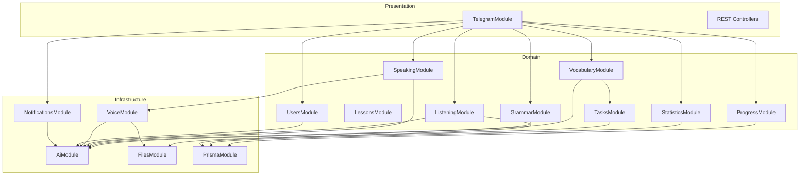
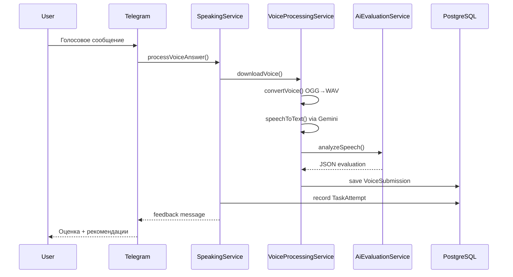

# UML диаграмма сущностей

## ER-диаграмма (Mermaid)

```mermaid
erDiagram
    User ||--o{ UserSkill : has
    User ||--o| UserStatistics : has
    User ||--o{ LearningPlan : has
    User ||--o{ Lesson : has
    User ||--o{ TaskAttempt : makes
    User ||--o{ VocabularyProgress : tracks
    User ||--o{ GrammarProgress : tracks
    User ||--o{ ListeningProgress : tracks
    User ||--o{ SpeakingProgress : tracks
    User ||--o{ UserAchievement : earns
    User ||--o{ DailyChallenge : receives
    User ||--o{ VoiceSubmission : submits
    User ||--o{ AiFeedback : receives

    LearningPlan ||--o{ Lesson : contains
    Lesson ||--o{ Task : contains
    Task ||--o{ TaskAttempt : has
    Task ||--o| DailyChallenge : is
    Task ||--o{ AiFeedback : generates

    VocabularyWord ||--o{ VocabularyProgress : tracked_in
    Achievement ||--o{ UserAchievement : awarded

    User {
        uuid id PK
        bigint telegram_id UK
        string display_name
        string learning_goal
        int daily_minutes
        enum onboarding_step
        boolean is_onboarded
        string current_state
        json state_data
        int rating
    }

    UserSkill {
        uuid id PK
        uuid user_id FK
        enum skill UK
        enum level
        float score
    }

    LearningPlan {
        uuid id PK
        uuid user_id FK
        string title
        json focus_areas
        json weekly_goals
        boolean is_active
    }

    Lesson {
        uuid id PK
        uuid user_id FK
        uuid learning_plan_id FK
        enum skill
        enum status
        int order_index
    }

    Task {
        uuid id PK
        uuid lesson_id FK
        enum type
        enum skill
        json content
        enum level
        int pass_score
        enum status
    }

    TaskAttempt {
        uuid id PK
        uuid task_id FK
        uuid user_id FK
        int attempt_num
        string user_answer
        int score
        boolean passed
        json errors
        json feedback
    }

    VocabularyWord {
        uuid id PK
        string word UK
        string translation UK
        string transcription
        string example
        enum level
    }

    VocabularyProgress {
        uuid id PK
        uuid user_id FK
        uuid word_id FK
        float familiarity
        datetime next_review_at
        int interval_days
        float ease_factor
    }

    VoiceSubmission {
        uuid id PK
        uuid user_id FK
        string telegram_file_id
        string transcript
        enum status
        json analysis_result
    }

    AiFeedback {
        uuid id PK
        uuid user_id FK
        uuid task_id FK
        string prompt_type
        json request
        json response
    }

    UserStatistics {
        uuid id PK
        uuid user_id FK UK
        int tasks_completed
        int tasks_failed
        float average_score
        int current_streak
        int longest_streak
    }

    Achievement {
        uuid id PK
        enum type UK
        string title
        int threshold
    }

    DailyChallenge {
        uuid id PK
        uuid user_id FK
        uuid task_id FK UK
        date date UK
        enum status
    }
```

## Диаграмма модулей NestJS



## Поток Speaking



## Навыки и уровни

Каждый пользователь имеет 6 записей `UserSkill`:

| Skill | Описание |
|-------|----------|
| SPEAKING | Говорение |
| LISTENING | Аудирование |
| VOCABULARY | Словарный запас |
| GRAMMAR | Грамматика |
| READING | Чтение |
| WRITING | Письмо |

Уровни: `BEGINNER → A1 → A2 → B1 → B2 → C1 → C2`

Повышение уровня: 10 успешных заданий подряд со средним баллом ≥ 80.
